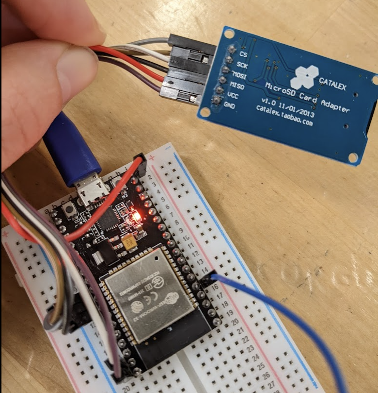
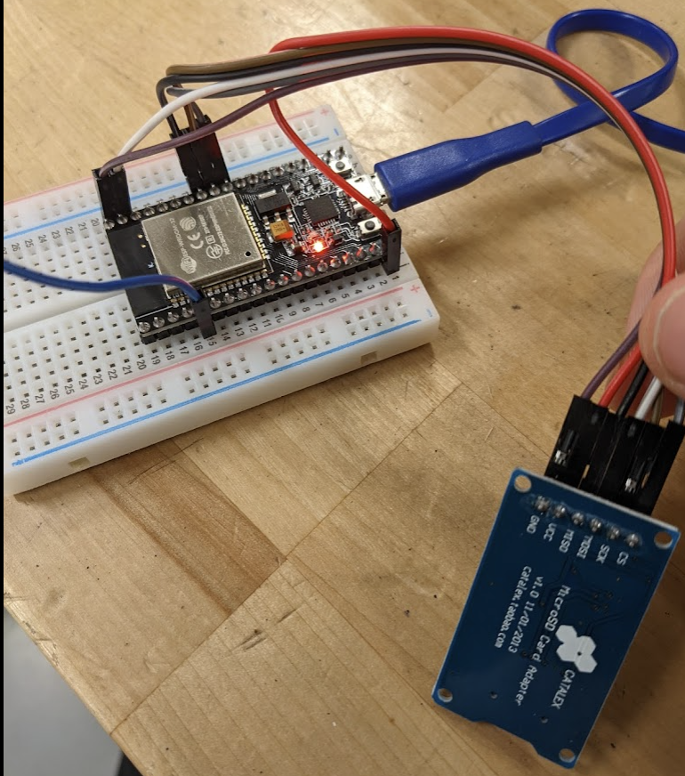

# Soil Percolation Tester
Automated soil percolation tester (WIP)

## How to use

Current working version for ESP32 test code in `/web_controller.ino/web_controller.ino.ino` *(yes, there's two ".ino"'s)*

To compile this code you will need to include the following libraries in your Arduino IDE: `/AsyncTCP-master.zip` and `/ESPAsyncWebServer-master.zip`.

### Steps to use:
1) Connect to the Wireless network `Percolation`
2) In your browser, navigate to `www.192.168.4.1` for the dashboard to see the live data output and toggle the valve
3) Navigate to `www.192.168.4.1/graph` to see a live graph of the data which uses the JS library called `highcharts.js`
4) Navigate to `www.192.168.4.1/download` to see the contents of the CSV file which logs the sensor data *(work in progress, not yet functional)*

### Next steps for the code
* Update the function `readPressureSensor()` with the most recent depth calculation. **NOTE: some of the threshold values will have to change because the way the ESP32 reads analog data is slightly different**
* Get `writeSD()` working properly so that it appends to the file instead of overwriting it
* Automatically toggle the valve when the depth reaches a certain threshold
* Update JS for the graph located on the SD card in `/graph.htm` to display a more readable output
* Create a captive portal to automatically redirect anyone who connects to the network to the dashboard at `www.192.168.4.1`
* Once functional, refactor the web controller to use `.html` files entirely stored on the SD card to decrease build time.
  * Then we can build a more intuitive user interface that looks pretty and scales for mobile devices
  * After that we write very descriptive documentation

## Hardware setup

The pressure sensor pin is currently set to use `P34` on the ESP32.

Here's a couple of images of the wiring diagram:

Note: the blue wire is for the pressure sensor

## Additional Tests

If you are having a hard time getting the SD card to be detected by the ESP32, try starting with the test code in `/esp32SDTest`